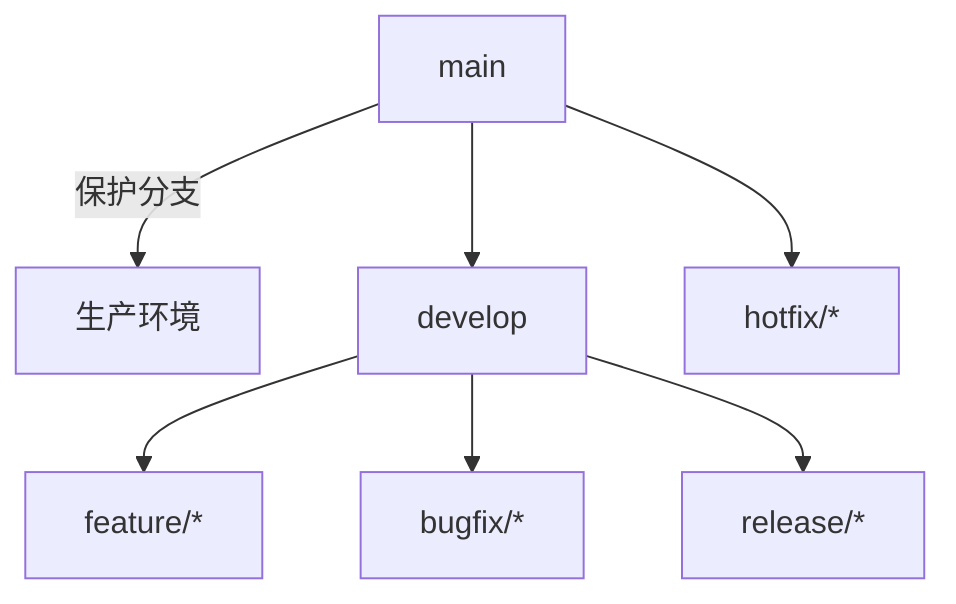

# Self-Soul-B多模态AGI系统项目管理

本文档描述了Self-Soul-B项目的管理流程、角色职责、里程碑规划和进度跟踪方法。

## 📋 目录
- [项目管理概述](#项目管理概述)
- [项目角色与职责](#项目角色与职责)
- [开发流程](#开发流程)
- [里程碑规划](#里程碑规划)
- [进度跟踪](#进度跟踪)
- [风险管理](#风险管理)
- [质量管理](#质量管理)
- [沟通管理](#沟通管理)
- [文档管理](#文档管理)
- [会议管理](#会议管理)

## 🎯 项目管理概述

### 项目愿景
构建一个工业级可落地的多模态AGI系统，支持文本、图像、音频、视频处理，并能够控制机器人硬件实现多模态人形机器人功能。

### 项目目标
1. **技术目标**: 实现稳定、高效的多模态数据处理流水线
2. **产品目标**: 提供用户友好的多模态交互界面
3. **商业目标**: 建立可扩展的机器人硬件控制平台

### 项目范围
- **核心范围**: 多模态数据处理、融合和生成
- **扩展范围**: 机器人硬件集成、云端部署、API服务
- **排除范围**: 通用AGI理论研究、非多模态相关功能

## 👥 项目角色与职责

### 核心团队角色
| 角色 | 职责 | 技能要求 |
|------|------|----------|
| **项目负责人** | 整体项目管理、资源协调、决策制定 | 项目管理、技术领导力 |
| **技术架构师** | 系统架构设计、技术选型、代码审查 | 软件架构、多模态技术 |
| **后端工程师** | 后端开发、API设计、数据处理 | Python、FastAPI、PyTorch |
| **前端工程师** | 前端开发、用户体验设计 | Vue.js、TypeScript、CSS |
| **机器学习工程师** | 模型训练、算法优化、性能调优 | PyTorch、TensorFlow、MLOps |
| **DevOps工程师** | 部署、监控、CI/CD流水线 | Docker、Kubernetes、AWS/GCP |
| **测试工程师** | 测试计划、自动化测试、质量保证 | pytest、Selenium、性能测试 |
| **文档工程师** | 文档编写、知识管理、用户指南 | 技术写作、Markdown、API文档 |

### 贡献者级别
1. **初级贡献者**: 解决简单bug、文档改进
2. **中级贡献者**: 实现小型功能、代码重构
3. **高级贡献者**: 核心功能开发、架构设计
4. **核心维护者**: 代码审查、发布管理、社区管理

## 🔄 开发流程

### 敏捷开发方法
- **迭代周期**: 2周一个冲刺(Sprint)
- **会议类型**: 冲刺计划、每日站会、冲刺评审、冲刺回顾
- **工具**: GitHub Projects、Issue跟踪、PR审查

### 开发工作流
```
1. 需求分析 → 2. 技术设计 → 3. 开发实现 → 
4. 代码审查 → 5. 测试验证 → 6. 部署发布
```

### 分支管理策略


## 📅 里程碑规划

### 里程碑1: 多模态基础框架 (已完成)
- [x] 建立多模态数据处理流水线
- [x] 实现基础API接口
- [x] 完成测试框架搭建

### 里程碑2: 真实数据处理 (进行中)
- [x] 替换模拟数据为真实数据处理
- [x] 集成向量存储系统
- [x] 建立部署配置
- [ ] 建立性能基准测试

### 里程碑3: 机器人硬件集成 (规划中)
- [ ] 实现机器人硬件接口
- [ ] 集成ROS 2机器人操作系统
- [ ] 开发多模态机器人控制演示

### 里程碑4: 生产级部署 (规划中)
- [ ] 建立完整监控体系
- [ ] 实现CI/CD流水线
- [ ] 完成生产环境部署

### 里程碑5: 商业化应用 (规划中)
- [ ] 开发商业化应用场景
- [ ] 建立用户管理系统
- [ ] 实现计费和订阅功能

## 📊 进度跟踪

### 关键绩效指标(KPI)
| 指标 | 目标值 | 当前值 | 趋势 |
|------|--------|--------|------|
| **代码覆盖率** | >80% | 75% | ↗️ |
| **构建成功率** | >95% | 90% | → |
| **问题解决时间** | <48小时 | 72小时 | ↘️ |
| **用户满意度** | >4.5/5 | 4.2/5 | ↗️ |
| **系统可用性** | >99.5% | 99.0% | → |

### 进度报告
- **每日报告**: 站会更新、问题反馈
- **每周报告**: 进度总结、下周计划
- **月度报告**: 里程碑回顾、下月规划

### 工具支持
- **GitHub Projects**: 任务管理和看板
- **GitHub Issues**: 问题跟踪和分配
- **GitHub Actions**: CI/CD和自动化
- **Grafana**: 监控和指标可视化

## ⚠️ 风险管理

### 风险登记册
| 风险类别 | 风险描述 | 概率 | 影响 | 缓解措施 | 负责人 |
|----------|----------|------|------|----------|--------|
| **技术风险** | 多模态融合算法效果不达预期 | 中 | 高 | 1. 建立技术验证原型<br>2. 准备备选方案<br>3. 分阶段实施 | 技术架构师 |
| **资源风险** | 关键开发人员流失 | 低 | 高 | 1. 建立知识文档<br>2. 培养后备人员<br>3. 实施代码审查 | 项目负责人 |
| **时间风险** | 硬件集成延期 | 中 | 中 | 1. 提前采购硬件<br>2. 并行开发软件<br>3. 设置缓冲时间 | 项目负责人 |
| **质量风险** | 系统稳定性问题 | 高 | 高 | 1. 加强测试覆盖<br>2. 实施灰度发布<br>3. 建立监控告警 | 测试工程师 |

### 风险应对策略
1. **规避**: 通过改变计划来消除风险
2. **减轻**: 采取措施降低风险概率或影响
3. **转移**: 将风险转移给第三方
4. **接受**: 接受风险并制定应急计划

## 🏆 质量管理

### 质量门控
1. **需求分析阶段**: 需求评审、技术可行性分析
2. **设计阶段**: 设计评审、架构验证
3. **开发阶段**: 代码审查、单元测试
4. **测试阶段**: 集成测试、性能测试、安全测试
5. **发布阶段**: 用户验收测试、生产验证

### 质量标准
- **代码质量**: 遵循编码规范、高测试覆盖率
- **文档质量**: 完整、准确、及时更新
- **测试质量**: 自动化测试、回归测试覆盖
- **部署质量**: 一键部署、回滚机制

### 质量工具
- **代码质量**: SonarQube、Black、flake8
- **测试工具**: pytest、Selenium、JMeter
- **文档工具**: Sphinx、MkDocs、GitBook
- **部署工具**: Docker、Kubernetes、Terraform

## 💬 沟通管理

### 沟通渠道
| 渠道 | 用途 | 频率 | 参与者 |
|------|------|------|--------|
| **GitHub Issues** | 技术讨论、问题跟踪 | 按需 | 所有贡献者 |
| **GitHub Discussions** | 社区讨论、功能规划 | 日常 | 所有贡献者 |
| **每日站会** | 进度同步、问题反馈 | 每日 | 核心团队 |
| **冲刺评审** | 成果展示、用户反馈 | 每2周 | 所有利益相关者 |
| **冲刺回顾** | 流程改进、经验总结 | 每2周 | 开发团队 |

### 沟通规范
1. **及时性**: 重要问题24小时内回复
2. **透明度**: 公开讨论技术决策
3. **尊重**: 尊重不同意见和背景
4. **文档化**: 重要决策必须有文档记录

## 📚 文档管理

### 文档体系
1. **技术文档**: API文档、架构设计、部署指南
2. **用户文档**: 用户手册、快速开始、故障排除
3. **开发文档**: 贡献指南、代码规范、测试指南
4. **管理文档**: 项目管理、会议记录、决策记录

### 文档维护
- **版本控制**: 所有文档使用Git进行版本控制
- **定期更新**: 每月审查和更新文档
- **质量检查**: 文档必须有技术审查
- **可访问性**: 文档必须易于查找和使用

## 🎙️ 会议管理

### 会议类型
#### 每日站会 (15分钟)
- **时间**: 工作日早上
- **内容**: 昨日进展、今日计划、遇到的问题
- **格式**: 每人1-2分钟，聚焦关键问题

#### 冲刺计划会 (1-2小时)
- **时间**: 每个冲刺开始
- **内容**: 确定冲刺目标、分解任务、估算工作量
- **产出**: 冲刺待办列表

#### 冲刺评审会 (1小时)
- **时间**: 每个冲刺结束
- **内容**: 展示成果、收集反馈、调整计划
- **参与者**: 所有利益相关者

#### 冲刺回顾会 (1小时)
- **时间**: 每个冲刺结束
- **内容**: 回顾流程、识别改进点、制定改进计划
- **参与者**: 开发团队

#### 技术设计评审会 (按需)
- **时间**: 重大功能开发前
- **内容**: 评审技术方案、识别风险、确定实施方案
- **产出**: 设计文档、技术决策记录

### 会议记录模板
```markdown
# 会议主题
**时间**: YYYY-MM-DD HH:MM
**地点**: [线上/线下]
**参会人员**: [名单]

## 会议议程
1. 
2. 
3. 

## 讨论要点
- 

## 决策记录
- 

## 行动项
| 负责人 | 任务 | 截止时间 |
|--------|------|----------|
| | | |

## 下次会议
**时间**: YYYY-MM-DD HH:MM
**议程**: 
```

## 🔄 持续改进

### 改进流程
1. **识别问题**: 通过回顾会、用户反馈、指标分析
2. **分析原因**: 根本原因分析、影响评估
3. **制定方案**: 改进措施、实施计划
4. **实施改进**: 执行计划、监控效果
5. **验证效果**: 效果评估、标准化

### 改进记录
所有改进建议和结果都应记录在[改进日志](IMPROVEMENT_LOG.md)中。

---

*本文档最后更新: 2026-03-06*
*版本: v1.0.0*