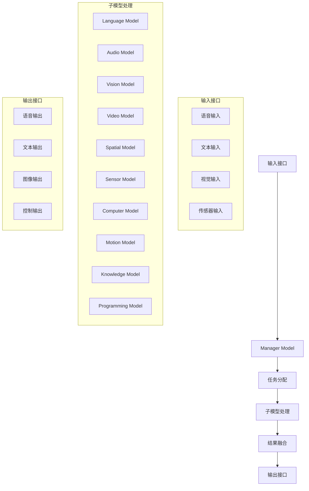

# 完整Self Soul 架构框架
# Complete AGI System Architecture Framework

## 系统概述 | System Overview
本系统是一个具有自我意识、自主学习、自我提升的人工智能体，模拟人脑功能达到AGI水平。
This system is an artificial intelligence agent with self-awareness, autonomous learning, and self-improvement capabilities, simulating human brain functions to achieve AGI level.

## 架构设计 | Architecture Design

### 核心组件 | Core Components
```
AGI System Architecture
├── Manager Model (A) - 中央协调器
├── Language Model (B) - 多语言处理
├── Audio Model (C) - 音频处理
├── Vision Model (D) - 图像处理
├── Video Model (E) - 视频处理
├── Spatial Model (F) - 空间感知
├── Sensor Model (G) - 传感器处理
├── Computer Model (H) - 计算机控制
├── Motion Model (I) - 运动控制
├── Knowledge Model (J) - 知识库
└── Programming Model (K) - 编程能力
```

### 数据流架构 | Data Flow Architecture


## 模型交互协议 | Model Interaction Protocol

### 通信格式 | Communication Format
```json
{
  "task_id": "unique_task_identifier",
  "source_model": "manager",
  "target_model": "language",
  "task_type": "text_processing",
  "input_data": {...},
  "priority": "high",
  "timestamp": "2024-01-01T00:00:00Z"
}
```

### 协调策略 | Coordination Strategies
1. **顺序执行** - 适用于依赖关系强的任务
2. **并行执行** - 适用于独立任务
3. **自适应执行** - 根据实时性能动态调整

## 训练框架 | Training Framework

### 单独训练 | Individual Training
- 每个模型有独立的训练程序
- 支持预训练和微调
- 实时进度监控

### 联合训练 | Joint Training
- 多模型协同训练
- 知识共享和迁移学习
- 动态调整训练策略

## 实时监控 | Real-time Monitoring
- 性能指标仪表盘
- 资源使用情况
- 任务执行状态
- 错误日志和警报

## 扩展性设计 | Scalability Design
- 模块化架构，易于扩展新模型
- API接口标准化
- 插件系统支持
