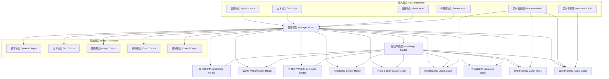

# Self Soul  完整解决方案框架
# Complete AGI Solution Framework

## 系统架构图 | System Architecture Diagram

## 逻辑数据流 | Logical Data Flow
1. **多模态输入 → 管理模型 → 任务分配 → 专业模型处理 → 结果整合 → 输出**
   - Multi-modal input → Manager model → Task allocation → Specialist model processing → Result integration → Output

2. **实时数据流 → 传感器/视频/音频模型 → 管理模型协调 → 响应输出**
   - Real-time data stream → Sensor/Video/Audio models → Manager model coordination → Response output

3. **训练流程 → 训练管理器 → 模型优化 → 性能评估 → 部署**
   - Training process → Training manager → Model optimization → Performance evaluation → Deployment

## 核心模型详细规范 | Core Model Specifications

### A. 管理模型 (Manager Model)
- **功能**: 中央协调器，任务分配，情感分析，多模型协作
- **输入**: 多模态数据（文本、语音、图像、传感器数据）
- **输出**: 协调指令、任务结果、情感响应
- **实时接口**: WebSocket连接，实时数据流处理

### B. 大语言模型 (Language Model)
- **功能**: 多语言处理，情感推理，文本生成，翻译
- **支持语言**: 中文、英文、德语、日语、俄语
- **情感分析**: 支持情感识别和情感化响应

### C. 音频处理模型 (Audio Model)
- **功能**: 语音识别，语音合成，音乐处理，噪音识别
- **实时输入**: 麦克风输入，网络音频流
- **输出**: 文本转录，合成语音，音频特效

### D. 视觉处理模型 (Vision Model)
- **功能**: 图像识别，图像编辑，图像生成
- **实时输入**: 摄像头输入，网络视频流
- **输出**: 识别结果，处理后的图像，生成图像

### E. 视频处理模型 (Video Model)
- **功能**: 视频内容识别，视频编辑，视频生成
- **实时输入**: 摄像头输入，网络视频流
- **输出**: 处理后的视频，分析结果

### F. 空间感知模型 (Spatial Model)
- **功能**: 空间识别，3D建模，距离感知，运动预测
- **输入**: 双目摄像头数据，深度传感器
- **输出**: 3D模型，空间坐标，运动轨迹

### G. 传感器模型 (Sensor Model)
- **功能**: 多传感器数据采集和处理
- **支持传感器**: 温湿度、加速度、陀螺仪、压力、光敏、红外等
- **实时接口**: GPIO、I2C、SPI接口支持

### H. 计算机控制模型 (Computer Model)
- **功能**: 系统控制，文件操作，进程管理
- **多系统支持**: Windows, Linux, macOS
- **MCP集成**: Windows MCP控制，系统API调用

### I. 运动控制模型 (Motion Model)
- **功能**: 执行器控制，运动规划，多协议支持
- **输出接口**: PWM, GPIO, UART, I2C, SPI
- **实时控制**: 毫秒级响应时间

### J. 知识库模型 (Knowledge Model)
- **功能**: 知识存储，检索，推理，学习
- **知识领域**: 物理、数学、化学、医学、法学、工程等
- **自我学习**: 从交互中学习，知识更新

### K. 编程模型 (Programming Model)
- **功能**: 代码生成，程序分析，自我改进
- **支持语言**: Python, JavaScript, C++, Java等
- **自我优化**: 程序性能分析，代码优化

## 训练框架设计 | Training Framework Design

### 单独训练模式
- 每个模型独立训练数据集
- 自定义训练参数（学习率、批次大小、迭代次数）
- 实时训练进度监控和可视化

### 联合训练模式
- 多模型协同训练
- 知识迁移和共享
- 动态调整训练策略
- 性能评估和比较

### 训练控制面板功能
- 训练任务创建和管理
- 训练参数配置
- 实时训练监控
- 训练结果分析和导出

## 实时接口设计 | Real-time Interface Design

### 视频输入接口
- 摄像头直接连接支持
- 网络视频流输入（RTSP, HTTP流）
- 实时帧处理和分析

### 音频输入接口
- 麦克风直接输入
- 网络音频流输入
- 实时音频处理和分析

### 传感器输入接口
- 物理传感器直接连接
- 传感器数据实时采集
- 多传感器数据融合

### 输出接口
- 实时语音合成输出
- 实时视频输出
- 实时控制信号输出

## 自我学习机制 | Self-learning Mechanism

### 知识获取
- 从交互中学习新知识
- 从外部数据源导入知识
- 从其他模型学习

### 自我优化
- 性能监控和自我调整
- 算法优化和参数调整
- 代码自我改进

### 协同学习
- 模型间知识共享
- 跨领域学习
- 集体智能提升

## 部署和实施计划 | Deployment and Implementation Plan

### 第一阶段：核心模型完善
- 完成所有模型的process方法实现
- 添加真实的训练逻辑
- 完善模型间通信协议

### 第二阶段：前端界面绑定
- 完善模型管理界面
- 实现训练控制面板
- 添加实时监控仪表盘

### 第三阶段：实时接口实现
- 实现传感器实时输入
- 实现视频/音频实时流处理
- 完善实时控制输出

### 第四阶段：自我学习集成
- 实现知识库学习机制
- 添加自我优化功能
- 完善协同学习框架

## 技术栈 | Technology Stack
- **后端**: Python 3.11+, FastAPI, WebSocket
- **前端**: Vue.js 3, Vite, TypeScript
- **机器学习**: PyTorch, TensorFlow, OpenCV
- **实时处理**: OpenCV, PyAudio, GPIO库
- **数据库**: SQLite, JSON文件存储
- **部署**: Docker, Kubernetes (可选)

## 性能指标 | Performance Metrics
- **响应时间**: <100ms 对于文本处理，<500ms 对于图像处理
- **准确率**: >90% 对于核心识别任务
- **吞吐量**: 支持并发多用户访问
- **可靠性**: 99.9% 正常运行时间

这个框架提供了完整的AGI系统设计，涵盖了所有需求点，并确保了系统的可扩展性和可维护性。
