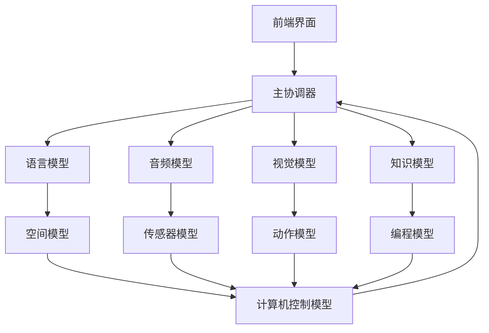
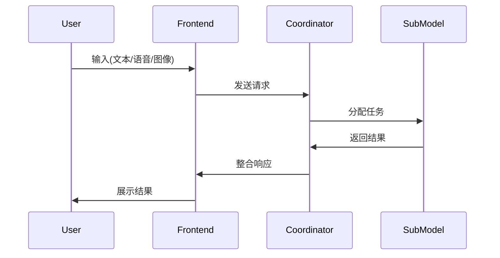

# Self Soul 系统架构设计

## 1. 系统概述
Self Soul 系统是一个多模态、跨领域的通用人工智能系统，旨在实现类似人类的认知和决策能力。系统由12个核心模型组成，通过中央协调器进行统一管理和任务分配。系统具有以下特点：
- **情感智能**：能够识别、分析和表达情感
- **多模态处理**：支持文本、语音、视觉、传感器等多种输入
- **自主优化**：具备自我编程改进能力
- **多语言支持**：支持5种语言界面切换
- **模型协作**：各专业模型协同解决复杂问题

## 2. 系统架构图



## 3. 核心模块说明

### 3.1 主协调器 (AGICoordinator)
- **功能**：
  - 注册和管理所有核心模型
  - 处理用户输入并分发任务
  - 协调多模型协作
  - 维护系统状态
  - 情感智能中枢
- **接口**：
  - `register_model(model_id, model_instance)`
  - `process_input(input_data, input_type)`
  - `get_system_status()`

### 3.2 管理模型 (ManagerModel)
- **功能**：
  - 多模态融合
  - 情感分析
  - 任务分配
  - 性能监控
- **接口**：
  - `analyze_emotion(input_data)`
  - `assign_task(task_description)`
  - `monitor_performance()`

### 3.3 语言模型 (LanguageModel)
- **功能**：
  - 多语言理解与生成
  - 情感推理
  - 语义分析
- **接口**：
  - `process_text(text, language)`
  - `generate_response(context)`
  - `detect_sentiment(text)`

### 3.4 音频模型 (AudioModel)
- **功能**：
  - 语音识别与合成
  - 语调分析
  - 音乐生成
- **接口**：
  - `speech_to_text(audio_data)`
  - `text_to_speech(text, emotion)`
  - `analyze_tone(audio_data)`

### 3.5 视觉模型 (VisionModel)
- **功能**：
  - 图像识别与生成
  - 视频内容理解
  - 视觉情感分析
- **接口**：
  - `recognize_image(image_data)`
  - `generate_image(description, emotion)`
  - `process_video(video_stream)`

### 3.6 知识模型 (KnowledgeModel)
- **功能**：
  - 跨领域知识存储与检索
  - 逻辑推理
  - 教学辅助
- **接口**：
  - `query_knowledge(topic)`
  - `infer(logic_expression)`
  - `explain_concept(concept)`

### 3.7 空间模型 (SpatialModel)
- **功能**：
  - 3D空间感知
  - 物体定位
  - 运动轨迹预测
- **接口**：
  - `create_3d_map(sensor_data)`
  - `locate_objects(environment_data)`
  - `predict_movement(object_id)`

### 3.8 传感器模型 (SensorModel)
- **功能**：
  - 多传感器数据融合
  - 环境状态监测
  - 实时数据流处理
- **接口**：
  - `read_sensor(sensor_type)`
  - `fuse_sensor_data(sensor_readings)`
  - `monitor_environment()`

### 3.9 动作模型 (MotionModel)
- **功能**：
  - 运动规划
  - 执行器控制
  - 多设备协同
- **接口**：
  - `plan_movement(target)`
  - `control_actuator(actuator_id, command)`
  - `coordinate_devices(device_list)`

### 3.10 编程模型 (ProgrammingModel)
- **功能**：
  - 自主代码生成
  - 系统优化
  - 问题诊断
- **接口**：
  - `generate_code(requirement)`
  - `optimize_system(component)`
  - `diagnose_issue(error_log)`

### 3.11 计算机控制模型 (ComputerControlModel)
- **功能**：
  - 跨平台系统控制
  - 资源管理
  - 安全监控
- **接口**：
  - `execute_command(os_command)`
  - `manage_resources()`
  - `monitor_security()`

## 4. 数据流

1. **用户输入** → 前端界面 → 主协调器
2. 主协调器解析输入 → 调用相应模型处理
3. 子模型处理数据 → 返回结果给主协调器
4. 主协调器整合结果 → 返回给前端界面
5. 前端界面展示结果给用户



## 5. API接口定义

### 5.1 主协调器API
- `process_user_input(input_data, input_type, language='zh')`
  - **参数**：
    - `input_data`: 用户输入数据(文本/音频/图像)
    - `input_type`: 输入类型('text','audio','image')
    - `language`: 语言代码(默认'zh')
  - **返回**：
    - `response`: 处理结果
    - `emotion`: 情感分析结果

### 5.2 模型注册API
- `register_model(model_id, endpoint, capabilities)`
  - **参数**：
    - `model_id`: 模型标识符
    - `endpoint`: 模型服务地址
    - `capabilities`: 模型能力描述
  - **返回**：
    - `status`: 注册状态('success'/'error')
    - `message`: 状态描述

### 5.3 系统状态API
- `get_system_status()`
  - **返回**：
    - `models`: 各模型状态列表
    - `performance`: 系统性能指标
    - `tasks`: 当前任务队列

## 6. 配置与部署

### 6.1 开发环境配置
- **前端**：
  - Vue 3 + Vite
  - Node.js 18+
- **后端**：
  - Python 3.10+
  - PyTorch 2.0+
  - FastAPI

### 6.2 部署方式
- **本地开发**：
  ```bash
  # 启动后端
  python start_agi.py
  
  # 启动前端
  cd app && npm run dev
  ```
  
- **生产环境**：
  ```bash
  # Docker部署
  docker-compose up --build
  
  # Kubernetes部署
  kubectl apply -f agi-deployment.yaml
  ```

### 6.3 配置文件
- `config/system.yaml` - 系统全局配置
- `config/models.yaml` - 模型参数配置
- `config/api_keys.yaml` - 第三方API密钥

## 7. 扩展性与维护

### 7.1 扩展机制
- 通过`register_model`API动态添加新模型
- 插件系统支持功能扩展
- RESTful API支持外部系统集成

### 7.2 维护策略
- 每日自动备份系统状态
- 异常检测与自动恢复
- 版本化模型更新
- 性能监控与报警

---
*Self Soul 系统遵循Apache 2.0开源协议*
*文档版本: 1.0.0 | 最后更新: 2025-08-19*